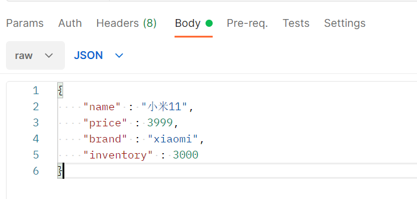

## ES在RestFul接口中进行操作

### 1.Index

通过 put 操作来进行插入操作：

```
插入index：（put）
http://localhost:9200/test

{
    "acknowledged": true,
    "shards_acknowledged": true,
    "index": "test"
}
```

通过 delete 操作来进行删除操作：

```
插入index：（delete）
http://localhost:9200/test

{
    "acknowledged": true
}
```

### 2.docment

#### **首先是对文档数据的插入：**

在数据中选择post来进行文档的插入，在Body中选择raw，然后使用json来进行操作：



**注意：必须要是POST的接口！！！**

```json
http://localhost:9200/shopping/_doc/0002（post）
{
    "_index": "shopping",
    "_type": "_doc",
    "_id": "0001",
    "_version": 3,
    "result": "updated",
    "_shards": {
        "total": 2,
        "successful": 1,
        "failed": 0
    },
    "_seq_no": 2,
    "_primary_term": 1
}

```

#### **文档的删除：**

```json
http://localhost:9200/shopping/_doc/0002（delete）
{
    "_index": "shopping",
    "_type": "_doc",
    "_id": "0002",
    "_version": 2,
    "result": "deleted",
    "_shards": {
        "total": 2,
        "successful": 1,
        "failed": 0
    },
    "_seq_no": 5,
    "_primary_term": 1
}
```

#### **文档的查询：**

> 注意：匹配查询和精确查询存在区别
>
> 使用term进行匹配查询使用的是精确查询
>
> 而使用match进行匹配查询所使用的是分词查询，就是会对所查询的字符串进行分词划分操作。
>
> 其中match中可以使用match_phase操作，对文档进行短语查询


**全量查询：**

```json
http://localhost:9200/shopping/_doc/0002（get）
{
    "_index": "shopping",
    "_type": "_doc",
    "_id": "0001",
    "_version": 4,
    "_seq_no": 3,
    "_primary_term": 1,
    "found": true,
    "_source": {
        "name": "小米11",
        "price": 3999,
        "brand": "xiaomi",
        "inventory": 3000
    }
}
```

**单个条件查询**

```json
http://localhost:9200/shopping/_search（get）
Body中添加的json：
{
    "query":{
        "match":{
            "name" : "小米11"
        }
    }
}
返回值：
{
    "took": 1085,
    "timed_out": false,
    "_shards": {
        "total": 1,
        "successful": 1,
        "skipped": 0,
        "failed": 0
    },
    "hits": {
        "total": {
            "value": 1,
            "relation": "eq"
        },
        "max_score": 0.8630463,
        "hits": [
            {
                "_index": "shopping",
                "_type": "_doc",
                "_id": "0001",
                "_score": 0.8630463,
                "_source": {
                    "name": "小米11",
                    "price": 3999,
                    "brand": "xiaomi",
                    "inventory": 3000
                }
            }
        ]
    }
}
```


