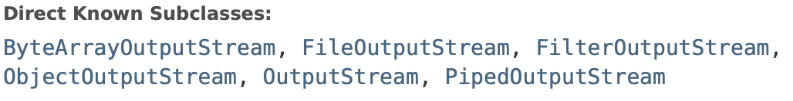

# IO

## 1.IO分类

从分类上IO主要分为字节流和字符流

字节是在机器中进行传输的流，而字符流是人的视觉角度传输的流。

### 字节流和字符流的区别

- 字节流读取单个字节，字符流读取单个字符(一个字符根据编码的不同，对应的字节也不同，如 UTF-8 编码是 3 个字节，中文编码是 2 个字节。)
- 字节流用来处理二进制文件(图片、MP3、视频文件)，字符流用来处理文本文件(可以看做是特殊的二进制文件，使用了某种编码，人可以阅读)。

### 字节流：

**in**

**out**

### 字符流：

**writer**

**reader**

## 2.传统IO

阻塞和非阻塞是程序级别实现的

- 阻塞
- 非阻塞

同步和非同步是系统级别实现的

- 同步
- 非同步

传统的阻塞模型就是，

