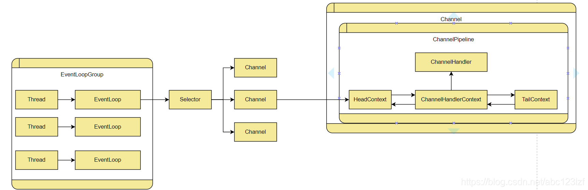
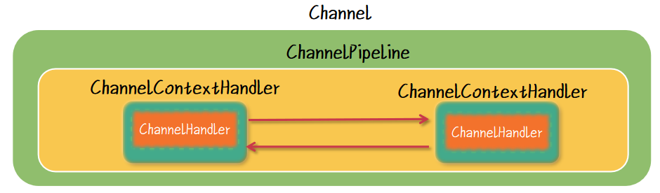
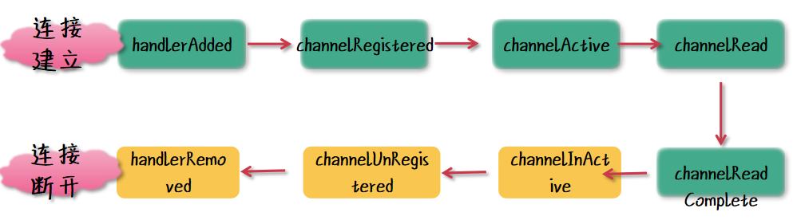
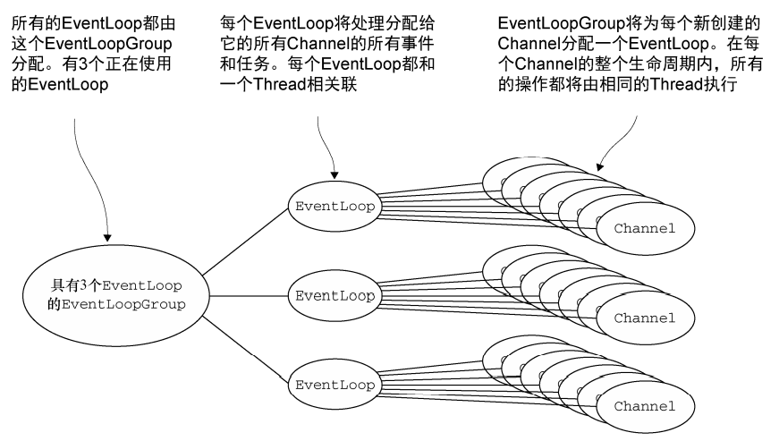

# Netty

Netty在java中使用非常广泛，通过对Java NIO进行梳理得到的一个易于使用的IO类型框架。


## 1.引导

存在两种类型的引导方式：一种用于客户端的是Bootstrap，另一种是用于服务端的ServerBootstrap。


ServerBootstrap存在两个EventLoopGroup，也就是在绑定这个引导时需要建立两个group，他们两个分别有着不同的作用，一个是监听作用，另一个是接受来自客户端的Channel。

## 2.ByteBuf

**优点：**

- 可以被用户自定义的缓冲区类型扩展
- 通过内置的复合缓冲区类型实现了透明的零拷贝
- 容量可以按需增长
- 在读和写这两种模式之间切换不需要调用ByteBuffer的flip方法
- 读和写使用了不同的索引
- 支持方法的链式调用
- 支持引用计数
- 支持池化

### ByteBuf 主要分为三种类型

- Pooled 和 Unpooled，池化和非池化；

- Heap 和 Direct，堆内存和直接内存；
- Safe 和 Unsafe，安全和非安全。

**池化和非池化**： 池化就是用完就放回池子里面，比如我们所熟悉的数据库连接池。非池化就是每次使用都重新创建，使用完成则立马销毁。从性能的角度来说，池化会比非池化相对高，因为可以重复利用，避免每次都重新创建。

**堆内存和直接内存**： 堆内存是 JVM 内部开辟的一块内存空间，它的生命周期受到 JVM 来管理，不容易造成内存溢出的情况。直接内存则是直接受操作系统管理了，如果数据量很大的情况，容易造成内存溢出情况。

**安全和非安全**： 主要是 Java 操作底层操作数据的一种安全和非安全的方式。


根据不同类型进行组合，得到常见 ByteBuf 的实现类

池化 + 堆内存，PooledHeapByteBuf；
池化 + 直接内存，PooledDirectByteBuf；
池化 + 堆内存 + 不安全，PooledUnsafeHeapByteBuf；
池化 + 直接内存 + 不安全，PooledUnsafeDirectByteBuf；
非池化 + 堆内存，UnpooledHeapByteBuf；
非池化 + 直接内存，UnpooledDirectByteBuf；
非池化 + 堆内存 + 不安全，UnpooledUnsafeHeapByteBuf；
非池化 + 直接内存 + 不安全，UnpooledUnsafeDirectByteBuf

### 2.1ByteBuf的使用模式

1.堆缓冲区

 堆缓冲区就是将数据存储在JVM的空间中。模式被称为支撑数组（backing array），可以在没有池化的情况下提供快速的分配和释放。

- 优点：可以看见，对堆缓冲区中的数据进行访问的时候，直接返回这个缓冲区数组的引用。
- 缺点：在每次进行IO操作的时候都需要将数据复制到直接缓冲区中


#### 2.直接缓冲区

直接缓冲区的内容是驻留在堆缓冲区之外的，在IO操作时可以直接将数据发送出去。

它的缺点和优点和堆缓冲区正好相反

每次对直接缓冲区中的数据进行访问时，不能直接返回一个数组的引用，而是要将复制到一个新生成的数组中，通过这个新数组来进行访问。


#### 3.复合缓冲区

复合缓冲区就是基于上述的两种缓冲区类型来进行实现的。

Composite是Netty所特有的一个缓冲区模式，可以复合地使用两种缓冲区模式

通过建立一个复合的缓冲模式，然后将另外的两个种类放入到这个组件中


### 2.2字节级操作

#### 2.2.1随机读写

通过调用get方法进行随机读写

```java
ByteBuf byteBuf = Unpooled.copiedBuffer("yili", CharsetUtil.UTF_8);
for (int i = 0; i < byteBuf.capacity(); i++) {
    byte b = byteBuf.getByte(i);
    System.out.println((char) b);
}
System.out.println(byteBuf.toString(CharsetUtil.UTF_8));
```

#### 2.2.2两种索引

由于ByteBuf中存在两种索引，所以在进行读写的时候不需要使用flip来进行读写转换，不用对此时是读模式还是写模式来进行判断。


可以在图中看见两个索引操作模式，readerIndex之前的字节都是可以进行抛弃的字节，中间的字节为可读字节，最后的是没有写入的字节，为可写字节。

## 3.Channel

在netty中也存在一个Channel，和 Java 原生 NIO 中的 Channel 




在Channel中存在着三个组件：ChannelPipeline,ChannelContextHandler,ChannelHandler.

这三个组件之间的关系如下：



pipline的使用很单一，一般就是将一个Handler加入到这个管道中。

### ChannelHandler

ChannelHandler也包含有两种传递方式：第一种是接入消息的传递，另一种是发出消息的传递

**Inbound 的顺序**

流转顺序： 多个 Inbound 不会自动往下流转，需要手工调用 ctx.fireChannelRead(msg); 才能流转到下一个；

执行顺序： 业务逻辑的执行顺序，则根据 ctx.fireChannelRead(msg); 和逻辑的先后顺序所决定；

Inbound 往 Outbound 流转，则需要手工 ctx.channel().writeAndFlush()。
**Outbound 的顺序**

流转顺序： 多个 Outbound 不会自动往下流转，需要手工调用 ctx.write(msg, promise); 才能流转到下一个；

执行顺序： 业务逻辑的执行顺序，则根据 ctx.write(msg, promise); 和逻辑的先后顺序所决定。


在Handler中生命周期如下：



需要注意的问题：

1. 注意 channelRead 和 channelReadComplete 之间的关系。
2. 注意 channel关闭会发生的事情
3. 注意在不同阶段所执行的次数

### EventLoop

EventLoop的核心作用是，将连接进入的客户端分配一个Channel，并且给Channel分配一个EventLoop和ChannelPipeline。一个负责Channel相关的业务处理，另一个负责管理业务逻辑。

1. 监控端口
2. 处理端口事件，将其分发
3. 处理队列事件

EvenLoop和Channel是一对多的关系



EventLoopGroup 负责为每个新创建的 Channel 分配一个 EventLoop。在当前实现中， 使用顺序循环（round-robin）的方式进行分配以获取一个均衡的分布，并且相同的 EventLoop 可能会被分配给多个 Channel。（这一点在将来的版本中可能会改变。） 

一旦一个 Channel 被分配给一个 EventLoop，它将在它的整个生命周期中都使用这个 EventLoop（以及相关联的 Thread）。请牢记这一点，因为它可以使你从担忧你的 ChannelHandler 实现中的线程安全和同步问题中解脱出来。 

另外，需要注意的是，EventLoop 的分配方式对 ThreadLocal 的使用的影响。因为一个 EventLoop 通常会被用于支撑多个 Channel，所以对于所有相关联的 Channel 来说， ThreadLocal 都将是一样的。这使得它对于实现状态追踪等功能来说是个糟糕的选择。然而， 在一些无状态的上下文中，它仍然可以被用于在多个 Channel 之间共享一些重度的或者代价昂 贵的对象，甚至是事件。

> 但是在阻塞模型下，数据的传播是基于一个Channel绑定一个EventLoop，不支持绑定多个。

## 

