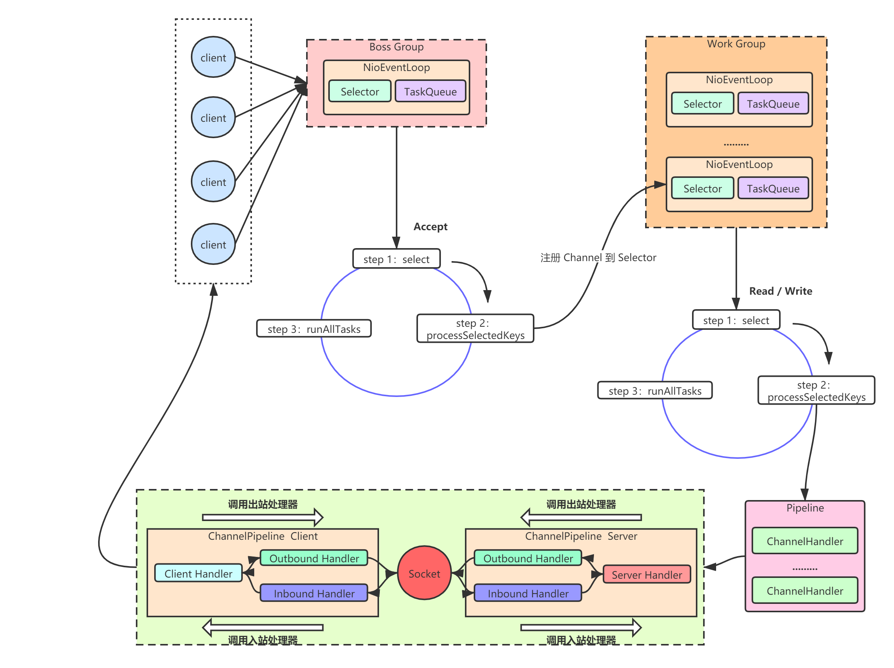
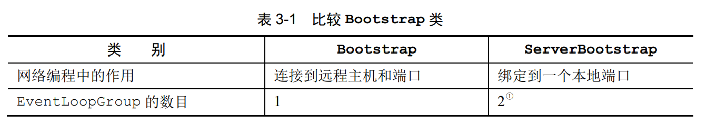
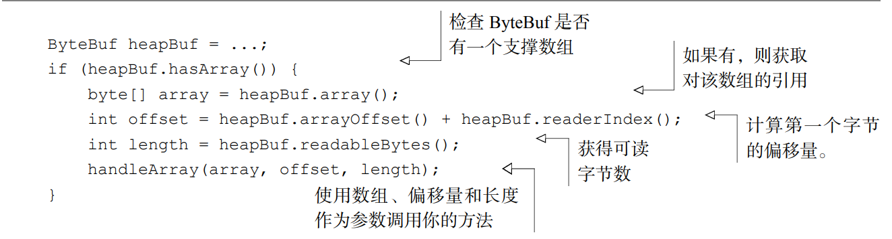
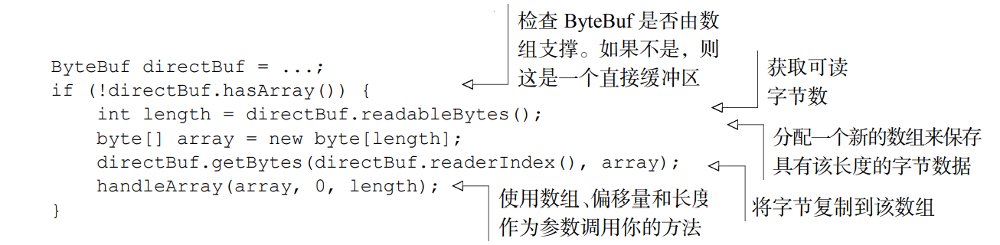
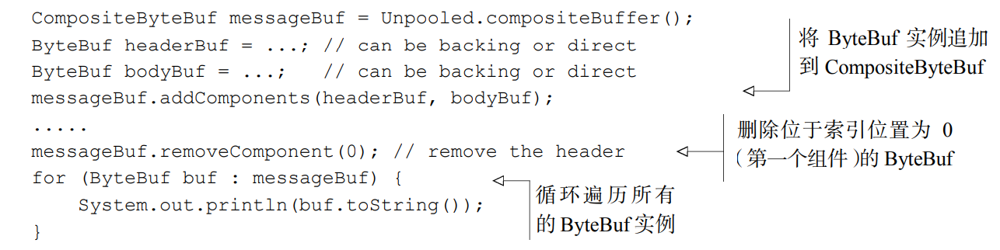

# Netty

Netty在java中使用非常广泛，通过对Java NIO进行梳理得到的一个易于使用的IO类型框架。

## 1.引导

存在两种类型的引导方式：一种用于客户端的是Bootstrap，另一种是用于服务端的ServerBootstrap。

ServerBootstrap存在两个EventLoopGroup，也就是在绑定这个引导时需要建立两个group，他们两个分别有着不同的作用，一个是监听作用，另一个是接受来自客户端的Channel。

## 2.ByteBuf

**优点：**

- 可以被用户自定义的缓冲区类型扩展
- 通过内置的复合缓冲区类型实现了透明的零拷贝
- 容量可以按需增长
- 在读和写这两种模式之间切换不需要调用ByteBuffer的flip方法
- 读和写使用了不同的索引
- 支持方法的链式调用
- 支持引用计数
- 支持池化

### ByteBuf 主要分为三种类型

- Pooled 和 Unpooled，池化和非池化；

- Heap 和 Direct，堆内存和直接内存；
- Safe 和 Unsafe，安全和非安全。

**池化和非池化**： 池化就是用完就放回池子里面，比如我们所熟悉的数据库连接池。非池化就是每次使用都重新创建，使用完成则立马销毁。从性能的角度来说，池化会比非池化相对高，因为可以重复利用，避免每次都重新创建。

**堆内存和直接内存**： 堆内存是 JVM 内部开辟的一块内存空间，它的生命周期受到 JVM 来管理，不容易造成内存溢出的情况。直接内存则是直接受操作系统管理了，如果数据量很大的情况，容易造成内存溢出情况。

**安全和非安全**： 主要是 Java 操作底层操作数据的一种安全和非安全的方式。

根据不同类型进行组合，得到常见 ByteBuf 的实现类

池化 + 堆内存，PooledHeapByteBuf；
池化 + 直接内存，PooledDirectByteBuf；
池化 + 堆内存 + 不安全，PooledUnsafeHeapByteBuf；
池化 + 直接内存 + 不安全，PooledUnsafeDirectByteBuf；
非池化 + 堆内存，UnpooledHeapByteBuf；
非池化 + 直接内存，UnpooledDirectByteBuf；
非池化 + 堆内存 + 不安全，UnpooledUnsafeHeapByteBuf；
非池化 + 直接内存 + 不安全，UnpooledUnsafeDirectByteBuf

### 1.堆缓冲区

 堆缓冲区就是将数据存储在JVM的空间中。模式被称为支撑数组（backing array），可以在没有池化的情况下提供快速的分配和释放。

- 优点：可以看见，对堆缓冲区中的数据进行访问的时候，直接返回这个缓冲区数组的引用。
- 缺点：在每次进行IO操作的时候都需要将数据复制到直接缓冲区中

### 2.直接缓冲区

直接缓冲区的内容是驻留在堆缓冲区之外的，在IO操作时可以直接将数据发送出去。

它的缺点和优点和堆缓冲区正好相反

每次对直接缓冲区中的数据进行访问时，不能直接返回一个数组的引用，而是要将复制到一个新生成的数组中，通过这个新数组来进行访问。

### 3.复合缓冲区

复合缓冲区就是基于上述的两种缓冲区类型来进行实现的。

Composite是Netty所特有的一个缓冲区模式，可以复合地使用两种缓冲区模式

通过建立一个复合的缓冲模式，然后将另外的两个种类放入到这个组件中

