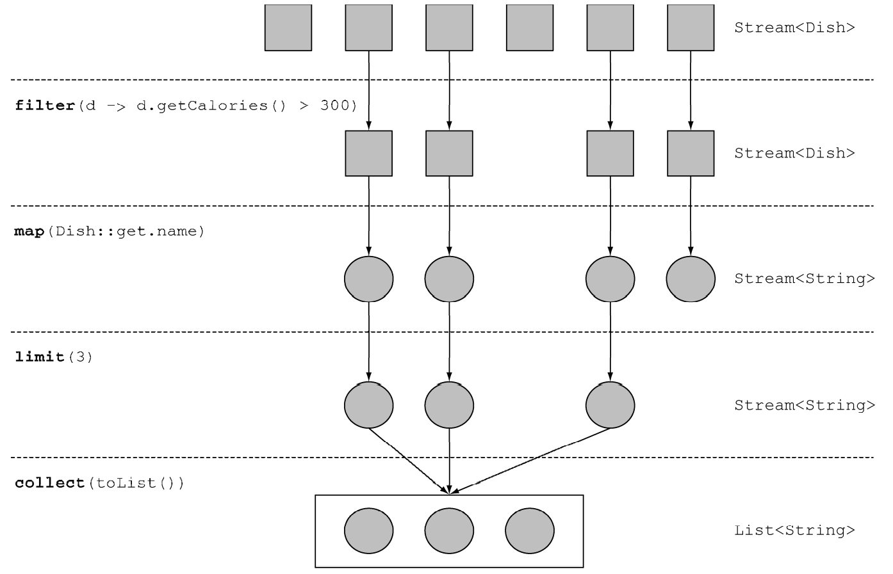
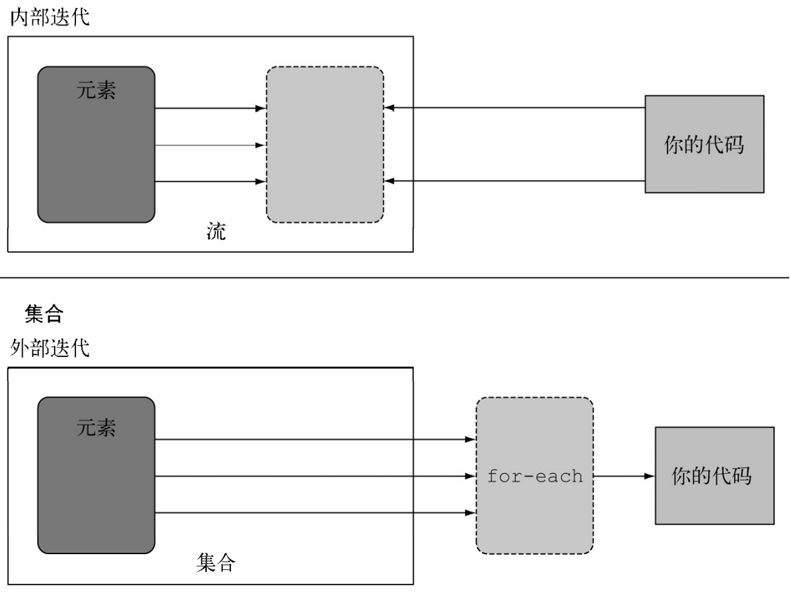
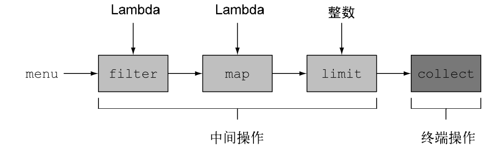
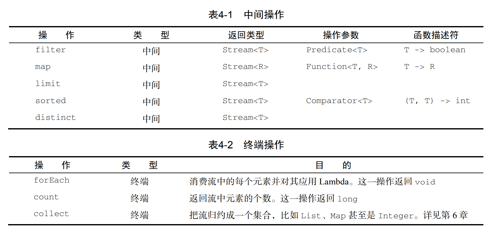
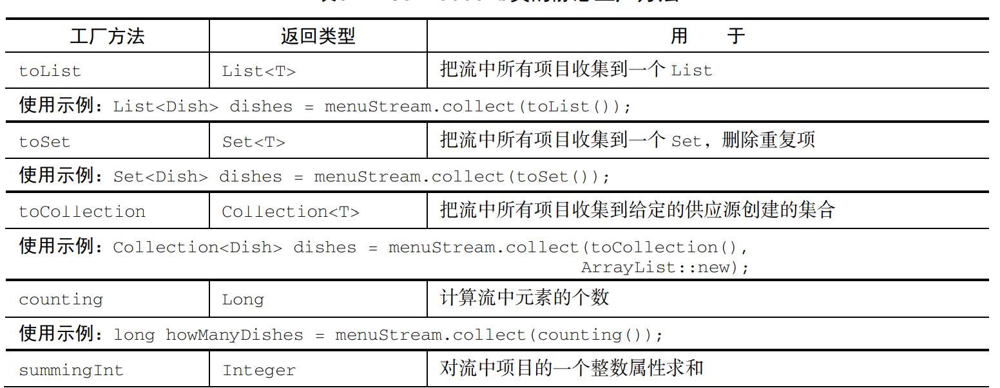

# Stream

### 流的介绍

在Java8中新增加了一个十分简化的操作：Stream

可以使用一种较为方便的方式来对集合中的数据进行处理。所以Stream也被称之为高级迭代器。

流的顺序是不可改变的：

filter-->map-->limit-->collect



**外部迭代和内部迭代**：

外部迭代就是使用for-each来对数据进行处理，在一个for循环中对数据进行处理，其在底层使用的是迭代器的语法糖模式。

内部迭代是通过map，filter，collect等流操作来对数据进行处理。



### 流的处理



使用流包括三个操作：

- 对数据源进行查询操作
- 中间链式操作
- 终端操作



### 使用流

#### 筛选和切片

**1.distinct**：将相同的数据进行筛选

```java
public class FilterTest {
    public static void main(String[] args) {
        List<Integer> list = Arrays.asList(1, 2, 4, 5, 6, 7);
        list.stream()
                .filter(integer -> integer%2==0)
                .distinct()
                //筛选相同的元素
                .forEach(System.out::println);
    }
}
```

**2.limit** 截取对应数字的元素

```java
public class FilterTest {
    public static void main(String[] args) {
        List<Integer> list = Arrays.asList(1, 2, 4, 5, 6, 7);
        list.stream()
                .filter(integer -> integer>2)
                .limit(2)
                //筛选相同的元素
                .forEach(System.out::println);
    }
}
4
5
```

**3.skip**：跳过对应数量的元素

```java
public class FilterTest {
    public static void main(String[] args) {
        List<Integer> list = Arrays.asList(1, 2, 4, 5, 6, 7);
        list.stream()
                .filter(integer -> integer>2)
                .skip(2)
                //筛选相同的元素
                .forEach(System.out::println);
    }
}
6
7
```

#### 映射

对流中的每个元素进行修改

```java
public class MapTest {
    public static void main(String[] args) {
        List<String> list = Arrays.asList("Java 8", "Lambdas", "In", "Action");
        List<String> collect = list.stream()
                .map(String::toLowerCase)
                .collect(Collectors.toList());
        System.out.println(collect);
    }
}
```

扁平化处理，可以将多个流转化为一个单一的流

```java
String[] words = {"GoodBye","World"};
List<String> stringList = Arrays.stream(words)
        .map(word -> word.split(""))
        .flatMap(Arrays::stream)
        .distinct()
        .collect(Collectors.toList());
for (String s : stringList) {
    System.out.println(s);
}
```

#### 匹配

检查流中的元素是否都满足系列条件

有下列方法可以使用：

Stream  API通过allMatch、anyMatch、noneMatch、findFirst和findAny方法提供了这样的工具。

```java
List<Integer> someNumbers = Arrays.asList(1, 2, 3, 4, 5); 
Optional<Integer> firstSquareDivisibleByThree = 
 someNumbers.stream() 
 .map(x -> x * x) 
 .filter(x -> x % 3 == 0) 
 .findFirst(); // 9 
```

### 流的收集

#### 收集

将一个流转化为一个流的形式：

```java
List<String> stringList = Arrays.stream(words)
        .map(word -> word.split(""))
        .flatMap(Arrays::stream)
        .distinct()
        .collect(Collectors.toList());
```

最基础的收集就是使用

counting来对流中的数目来进行计算

long howManyDishes = menu.stream().collect(Collectors.counting()); 

```java
//使用minBy来计算最小值
public static <T> Collector<T, ?, Optional<T>>
minBy(Comparator<? super T> comparator) {
    return reducing(BinaryOperator.minBy(comparator));
}
//使用maxBy来计算最大值
public static <T> Collector<T, ?, Optional<T>>
maxBy(Comparator<? super T> comparator) {
    return reducing(BinaryOperator.maxBy(comparator));
}
//使用sumingInt来计算总数
public static <T> Collector<T, ?, Integer>
    summingInt(ToIntFunction<? super T> mapper) {
    return new CollectorImpl<>(
        () -> new int[1],
        (a, t) -> { a[0] += mapper.applyAsInt(t); },
        (a, b) -> { a[0] += b[0]; return a; },
        a -> a[0], CH_NOID);
}
//使用averagingInt来对数据统计平均值信息
Double collect = transactions.stream()
    .collect(Collectors.averagingInt(Transaction::getValue));
System.out.println(collect);
```

#### 分组处理

分组处理将不同的数据分割到不同的value中。

和在数据库中对数据进行分组操作是十分相似的，所以使用

```java
Map<Integer, List<Transaction>> map = transactions.stream()
        .collect(Collectors.groupingBy(Transaction::getYear));
```

#### 分区处理

分区处理和分组处理十分相似，不过是直接使用布尔类型的值来进行处理，比如需要将满足条件和不满足条件的值分割开来。

```java
public Map<Boolean, List<Integer>> partitionPrimes(int n) { 
 	return IntStream.rangeClosed(2, n).boxed() 
 		.collect( 
		 partitioningBy(candidate -> isPrime(candidate))); 
} 
```

以上是使用分区处理来得到一个Map

#### Collectors的工厂方法



