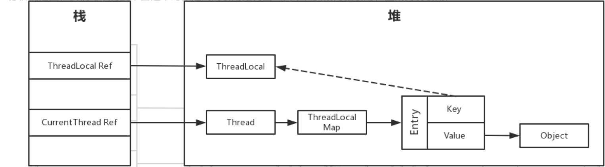

## ThreadLocal

### 1.是什么

ThreadLocal是一个线程局部模型，在多线程的场景中应用十分广泛。 一个ThreadLocal中存在着多个线程所保存的映射，通过将线程的引用加入，可以通过线程的引用作为key来查找map中存在的值。

>   注意：
>
>   一个线程可以有多个ThreadLocal，一个ThreadLocal可以保存多个Thread，所以它们之间是多对多的关系。
>
>   如果想查找一个线程中的一个ThreadLocal中的值时，


### 2.ThreadLocal方法

`set()`方法

```java
public void set(T value) {
    Thread t = Thread.currentThread();
    ThreadLocalMap map = getMap(t);
    if (map != null)
        map.set(this, value);
    else
        createMap(t, value);
}
```

分析：

1.   首先通过currentThread获取当前操作的线程
2.   通过线程来获得一个ThreadLocalMap
3.   如果ThreadLocalMap不存在，则以当前的ThreadLocal创建一个ThreadLocalMap
4.   如果存在则返回此ThreadLocal所对应的value
5.   通过对这个value进行重新赋值来进行修改


`get()` 方法

```java
public T get() {
    Thread t = Thread.currentThread();
    ThreadLocalMap map = getMap(t);
    if (map != null) {
        ThreadLocalMap.Entry e = map.getEntry(this);
        if (e != null) {
            @SuppressWarnings("unchecked")
            T result = (T)e.value;
            return result;
        }
    }
    return setInitialValue();
}
```

get所进行的操作和set大致相同。


`remove()`方法

```java
public void remove() {
    ThreadLocalMap m = getMap(Thread.currentThread());
    if (m != null)
        m.remove(this);
}
```

在这个操作中，首先还是对map进行获取，将在map中保存的他hreadLocal进行删除。

### 3.内存泄漏



由于Entry中所保存对ThreadLocal是作为虚引用。在下一次GC后key值的引用就会消失，ThreadLocal会被虚拟机进行回收。

但是还存在着一个强引用链

***CurrentThread Ref -> Thread -> ThreadLocalMap -> Entry -> value***

除非这个线程结束，不然Entry中的value是无法进行释放的，造成了内存泄漏。

那么官方是如何解决内存泄漏的问题呢？

```java
private Entry getEntry(ThreadLocal<?> key) {
    int i = key.threadLocalHashCode & (table.length - 1);
    Entry e = table[i];
    if (e != null && e.get() == key)
        return e;
    else
        return getEntryAfterMiss(key, i, e);
}
```

可以看见是通过hash值来获取key所在的位置的，如果发生哈希冲突时，会继续向下进行搜索。

```java
private Entry getEntryAfterMiss(ThreadLocal<?> key, int i, Entry e) {
    Entry[] tab = table;
    int len = tab.length;

    while (e != null) {
        ThreadLocal<?> k = e.get();
        if (k == key)
            return e;
        if (k == null)
            expungeStaleEntry(i);
        else
            i = nextIndex(i, len);
        e = tab[i];
    }
    return null;
}
```

在搜索的过程中，会对

key为null的entry进行删除操作，将value的值赋值为null，之后在gc的时候value会被清除。

