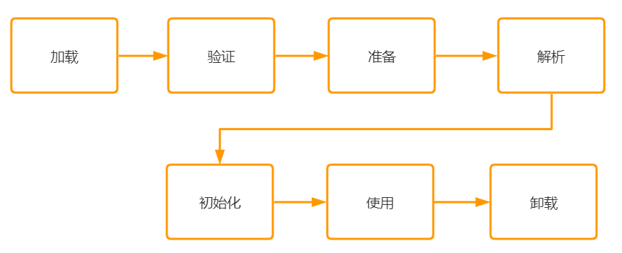
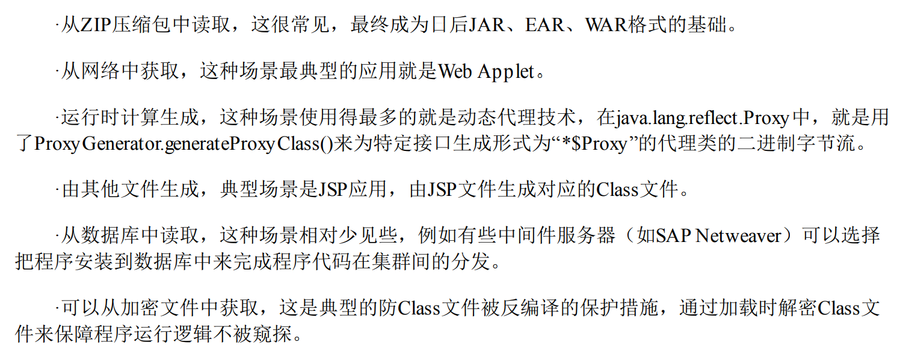
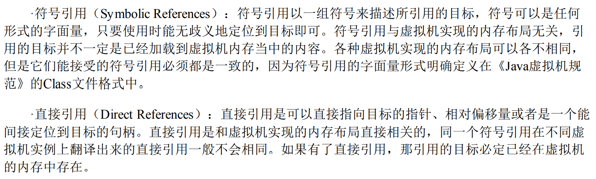

# 类加载过程



### 1.加载（Loading）

1）通过类的全限定名得到类的二进制文件信息，这个二进制文件信息是可以通过多种方式来得到的

2）将类的静态信息装载到方法区中

3）在内存中生成这个类的java.lang.class的信息，作为读取这个类的信息的接口

下面是介绍的可以得到二进制流的方式



### 2.验证

验证阶段是较为重要的一个阶段，是因为如果这个类不满足jvm处理的规范，则可能会发生某些不可逆的异常，会对生产环境造成某些不可逆的影响。

而验证主要分为以下几个阶段：

1）文件格式验证：验证这个文件是否满足版本号的规定

2）元数据验证：比如这个类所引用的数据是否满足规范（如果一个类继承一个final类是不允许的）

3）字节码验证：对这个class所进行的操作进行判断，比如对一个栈的调用是否符合规范等

4）符号引用验证：该类是否缺少或者被禁止访问它依赖的某些外部类、方法、字段等资源。符号所引用的值是否可以找到对应的值，所引用的值是否可以被当前类进行访问。

### 3.准备

对类的对象进行基础赋值（但是不包括final类型的常量值，常量值会直接在运行时常量池进行处理）

> 在JDK 7及之前，HotSpot使用永久代来实现方法区时，实现是完全符合这种逻辑概念的；而在JDK 8及之后，类变量则会随着Class对象一起存放在Java堆中，这时候“类变量在方法区”就完全是一种对逻辑概念的表述了

**特别注意**：准备阶段的数据并不会对实例变量进行赋值

### 4.解析

将符号引用转化为直接引用，就是将规范的值转化为内存中的值



> 解析动作主要针对类或接口、字段、类方法、接口方法、方法类型、方法句柄和调用点限定符这7 类符号引用进行，分别对应于常量池的其中8种常量类型

### 5.初始化

初始化：**为静态变量赋予正确的值，并合并静态代码块**

流程：

1）生成类构造器方法clinit()，即合并所有的静态变量和静态代码块
2）执行clinit()

> clinit()方法对于类或接口来说并不是必需的，如果一个类中没有静态语句块，也没有对变量的 赋值操作，那么编译器可以不为这个类生成()方法。

关于静态语句块：**静态语句块中只能访问到定义在静态语句块之前的变量，定义在它之后的变量，在前面的静态语句块可以赋值，但是不能访问**

下面的代码是错误的！！！

```java
public class StringDemo {
    static {
        sta = 4;
        System.out.println(sta);
    }
    public static int sta = 2;
}
```

