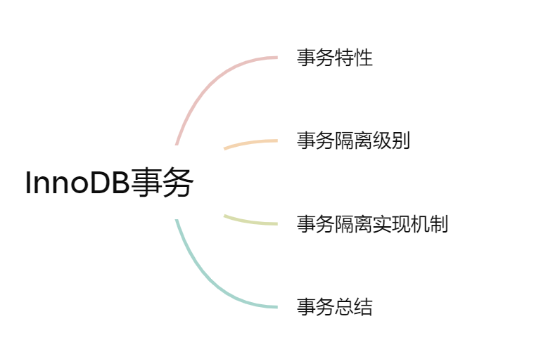

## 数据库事务

**下面为本篇文章的大纲：**

### 1.事务特性

在事务中的特性可以简称为**ACID特性**，分别代表四个数据库事务所具有的特性。

实现事务必须要遵守 4 个特性，分别如下：

- **原子性（Atomicity）**：一个事务作为一个不可分割的最小单元。一个事务中的所有操作，要么全部完成，要么全部不完成，不会结束在中间某个环节，而且事务在执行过程中发生错误，会被回滚到事务开始前的状态，就像这个事务从来没有执行过一样；
- **一致性（Consistency）**：数据库的完整性不会因为事务的执行而受到破坏，数据库总是从一个一致性的状态转换到另一个一致性的状态。比如在转账事务中，必须保证双方的总额是不会发生改变的，也称之为逻辑一致性。
- **隔离性（Isolation）**：一个事务在提交之前，对其他事务是不可见的，在一定情况下避免了脏读的发生。
- **持久性（Durability）**：一旦事务进行提交之后，对数据的修改就是永久的，即便系统故障也不会丢失。

> **那么数据库是如何实现这四个特性的呢？**

1. 对于`原子性（Atomicity）`和`一致性（Consistency）`，数据库可以通过底层的一个**redo log**机制来进行实现，主要是对事务的**rollback**操作来进行处理实现的
2. 对于数据的`持久性（Durability）`,数据库通过undo log来进行保证，原理是数据库引擎会先将修改的数据放到undo log中，而不会直接对数据库中的信息进行修改。在数据库出现故障时，虽然暂时没有对数据库进行修改，但是undo log会完整的保留下来，所以无需担心数据库中的数据出现变化。
3. `隔离性（Isolation）`是对于数据库事务最为重要的一个特性，因为其保证了在并发状态下数据库的稳定运行，而不会出现不同的事务进行干扰，造成数据库中的数据出现紊乱的情况。而隔离性的实现则是通过InnoDB引擎所独有的MVCC+锁的重要工具来进行实现。

**由于隔离性对于数据库事务的理解十分重要，下面开始重点介绍数据库的各种隔离特性**

### 2.**事务隔离级别**

1. READ UNCOMMITTED（未提交读）

   顾名思义，就是没有对事务进行提交，就将数据库中的内容进行修改，并且其他事务是可见的，由于其他事务对数据进行修改后对本事务是可见的所以也被称之为`脏读`。

2. READ COMMIT（提交读）

   也就是一个事务提交后，才可以读取其提交的数据，如果没有提交，是无法对其数据进行读取的。

   但是这同样会出现一个问题：**不可重复读**，一个事务中读取的两个数据可能出现不相同的情况。

3. REPEATABLE READ（可重复读）

   虽然可重复读解决了脏读的问题，同时也解决了两次读取的不相同的情况，但是还是会产生幻读的情况。出现幻读的情况主要是因为新插进来的数据没办法限制。如果一个事务查询一个数据之后，会为查询到的行都添加一个悲观锁，所以这些数据都没有办法被删除或者修改，但是无法限制新添加进来的数据，如果新来的数据符合这个集合的要求，则会出现**幻读**，凭空多出来的数据。

   **注意：**在InnoDB数据库引擎中采用了间隙锁(next-key locking) 策略防止幻读的产生，也就是将之前读取的数据行之间的间隔也进行了锁定，防止了幻影行的插入。

4. SERIALIZABLE（可串行化）

   **SERIALIZABLE**是最高的隔离级别，不会出现以上的所有情况是因为开启了事务的串行化，也就是会在每行数据上都进行加锁操作，只有在确定数据一致性以及可以接受没有并发的情况下才使用这个隔离级别。

   

**隔离级别的排序：**

### 3.事务隔离实现机制

