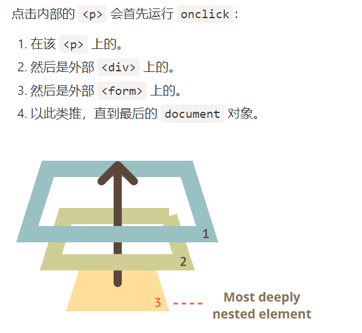

## 浏览器事件

### 事件简介：

**鼠标事件：**

- `click` —— 当鼠标点击一个元素时（触摸屏设备会在点击时生成）。
- `contextmenu` —— 当鼠标右键点击一个元素时。
- `mouseover` / `mouseout` —— 当鼠标指针移入/离开一个元素时。
- `mousedown` / `mouseup` —— 当在元素上按下/释放鼠标按钮时。
- `mousemove` —— 当鼠标移动时。

**键盘事件**：

- `keydown` 和 `keyup` —— 当按下和松开一个按键时。

**表单（form）元素事件**：

- `submit` —— 当访问者提交了一个 `<form>` 时。
- `focus` —— 当访问者聚焦于一个元素时，例如聚焦于一个 `<input>`。

**Document 事件**：

- `DOMContentLoaded` —— 当 HTML 的加载和处理均完成，DOM 被完全构建完成时。

**CSS 事件**：

- `transitionend` —— 当一个 CSS 动画完成时。

还有很多其他事件。我们将在下一章中详细介绍具体事件。

### 事件使用：

如果直接在一个Node中对事件进行添加时，需要在具体的事件上加上一个on，才可以对事件进行覆盖；

同时也可使用一个监听器来对事件进行操作：

```javascript
element.addEventListener(event, handler[, options]);
```

同理也可以对事件进行移除操作：

```javascript
element.removeEventListener(event, handler[, options]);
```


## 事件的冒泡

由于Html中会存在顺序输出，所以在对一个子元素进行点击的时候，他的父元素（整体元素）也是会响应的。而在所有的节点中都放置一个事件的时候，会出现冒泡进行输出，也就是从内到外依次响应事件。



> 几乎所有的事件都会冒泡：除了focus事件


可以使用event.stopImmediatePropagation()来中止冒泡，其他的程序会进行执行。

> **不要在没有需要的情况下停止冒泡！**
>
> 冒泡很方便。不要在没有真实需求时阻止它：除非是显而易见的，并且在架构上经过深思熟虑的。
>
> 有时 `event.stopPropagation()` 会产生隐藏的陷阱，以后可能会成为问题。
>
> 例如：
>
> 1. 我们创建了一个嵌套菜单，每个子菜单各自处理对自己的元素的点击事件，并调用 `stopPropagation`，以便不会触发外部菜单。
> 2. 之后，我们决定捕获在整个窗口上的点击，以追踪用户的行为（用户点击的位置）。有些分析系统会这样做。通常，代码会使用 `document.addEventListener('click'…)` 来捕获所有的点击。
> 3. 我们的分析不适用于被 `stopPropagation` 所阻止点击的区域。太伤心了，我们有一个“死区”。
>
> 通常，没有真正的必要去阻止冒泡。一项看似需要阻止冒泡的任务，可以通过其他方法解决。其中之一就是使用自定义事件，稍后我们会介绍它们此外，我们还可以将我们的数据写入一个处理程序中的 `event` 对象，并在另一个处理程序中读取该数据，这样我们就可以向父处理程序传递有关下层处理程序的信息。

## 事件委托

事件委托的主要使用方式就是通过：event.target.dataset 来进行访问。

如果有很多类似的处理元素，比如需要将事件绑定到所有的特定子元素上时，这个时候对每个子元素进行绑定会十分的麻烦，所以可以考虑将事件绑定在一类的元素上，就可以规避这种麻烦。

在事件处理时，使用event.target来获取对象所发生的位置：

比如一个父元素被事件响应时，可以通过对事件响应监听得到一个响应的位置：

```javascript
let selectedTd;

table.onclick = function(event) {
  let target = event.target; // 在哪里点击的？

  if (target.tagName != 'TD') return; // 不在 TD 上？那么我们就不会在意

  highlight(target); // 高亮显示它
};
```

> 注意：可以在html元素中添加一个data-开头的元素
>
> 这个元素在页面中不会显示，但是是可以通过DOM来进行读写操作的。

比如在一个html的元素中添加一个data-counter元素，可以对存在的个数进行计数。

```xml
Counter: <input type="button" value="1" data-counter>
One more counter: <input type="button" value="2" data-counter>

<script>
  document.addEventListener('click', function(event) {

    if (event.target.dataset.counter != undefined) { // 如果这个特性存在...
      event.target.value++;
    }

  });
</script>
```

