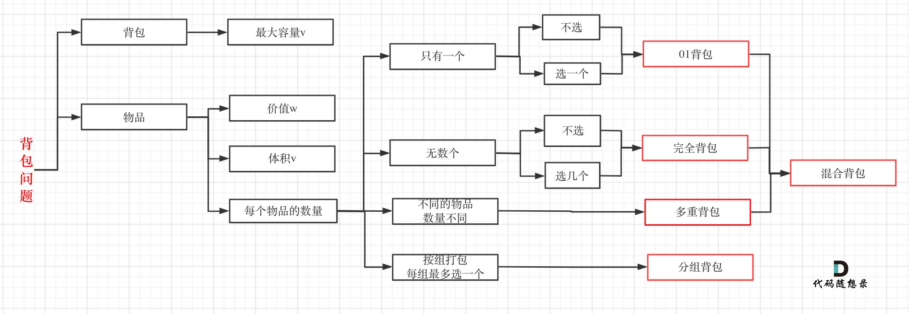

### 背包问题

本图来源: **代码随想录**

#### 0-1背包问题

参考问题:

0-1背包问题是背包问题的最基础情况，分为一维和二维的情况，如果是质量和价值等同，则可以视为一维背包问题，比如：

将重量为[x,y,z....]等石头放入容量为cap的背包中，请问最多可以装多少公斤的石头，其实最大能装的石头就是背包的重量个数的石头，但是可能石头的质量和加起来是无论如何也加不到cap的，所以这时候需要进行动态规划处理。

先列状态方程得到一维的dp数组