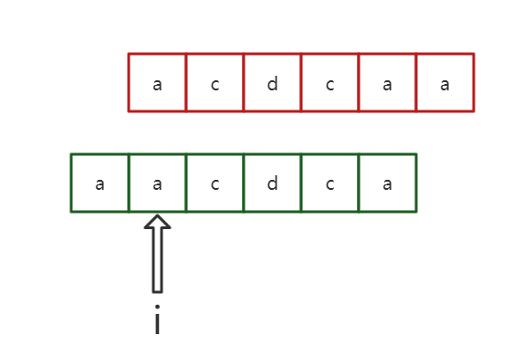

**本次题目:[leetcode-214:最短回文串](https://leetcode-cn.com/problems/shortest-palindrome/ )**

给定一个字符串 s，你可以通过在字符串前面添加字符将其转换为回文串。找到并返回可以用这种方式转换的最短回文串。

```
示例 1：
输入：s = "aacecaaa"
输出："aaacecaaa"

示例 2：
输入：s = "abcd"
输出："dcbabcd"
```

### 1.小试牛刀

在最开始看到这个题目时，我使用了之前在[leetcode-5：最长回文子串](https://leetcode-cn.com/problems/longest-palindromic-substring/) 中所使用的中心扩散法，也就是遍历字符，然后从字符的中心向两边不断扩散，直到找到最短的回文串数，然后通过最短的结果和其所在的索引再继续补齐,然后越写越复杂，现在看来这是一个非常错误的方法。

在回文数中，第一件要考虑的就是回文数的特性，而不是一本正经的使用暴力去解。

所以先将回文串进行反转，得到一个序列相反的字符串，然后从反转字符串的每个位置向后进行遍历，如果原字符串中的对应位置都和相反字符串中的位置相同，则这个索引就是所需要的索引。



```java
class Solution {
    public String shortestPalindrome(String s) {
        String reverse = new StringBuffer(s).reverse().toString();
        for(int i=0;i<reverse.length();i++){
            if(s.startsWith(reverse.substring(i))){
                return reverse.substring(0,i)+s;
            }
        }
        return "";
    }
}
```

### 2.KMP算法

KMP的实现过程参考 [KMP字符串算法](KMP字符串算法.md) 

和匹配字符串唯一不相同的地方是不需要判断k的大小然后返回，直接匹配得到最后的k便是所需要的结果。

-------

```java
class Solution {
    public String shortestPalindrome(String s) {
        int n = s.length();
        int next[] = new int[n];
        int k = 0;
        for (int i = 1; i < n; ++i) {
            while(k>0&&s.charAt(i)!=s.charAt(k))
                k = next[k-1];
            if(s.charAt(i)==s.charAt(k))
                k++;
            next[i] = k;
        }
        k = 0;
        for(int i = n-1;i>=0;i--){
            while(k>0&&s.charAt(i)!=s.charAt(k))
                k = next[k-1];
            if(s.charAt(i)==s.charAt(k))
                k++;
            if(k==i+1)
                break;
        }
        String add = (k == n ? "" : s.substring(k));
        StringBuffer ans = new StringBuffer(add).reverse();
        ans.append(s);
        return ans.toString();
    }
}
```

