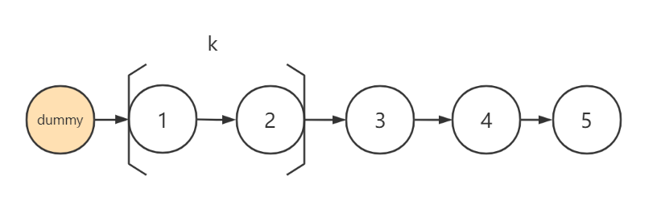

# 反转链表

本文部分参考：https://labuladong.gitbook.io/algo/mu-lu-ye-1/mu-lu-ye

**反转链表是一种类型的题目，所以需要分几个模块：**

## 1.基础

基础题目：[leetcode-206反转链表](https://leetcode-cn.com/problems/reverse-linked-list/submissions/)

#### 递归实现

递归实现反转链表是非常重要的概念，需要重点的去记忆，可以当作公式去记忆。

```java
class Solution {
    public ListNode reverseList(ListNode head) {
        if(head==null||head.next == null) 
            return head;
        ListNode node = reverseList(head.next);
        head.next.next = head;
        head.next = null;
        return node;
    }
}
```

#### 迭代实现

注意，迭代实现需要构建两个指针来进行执行

```java
class Solution {
    public ListNode reverseList(ListNode head) {
        ListNode pre = null;
        ListNode next = null;
        while(head!=null){
            next = head.next;
            head.next = pre;
            pre = head;
            head = next;
        }
        return pre;
    }
}
```

## 2.进阶

[leetcode-92:反转链表II](https://leetcode-cn.com/problems/reverse-linked-list-ii/)

升级版本的反转链表操作，可以限定性的将链表进行反转，得到一个只有局部反转的链表。

#### 递归实现

```java
class Solution {
    ListNode successor = null;
    ListNode last = null;
    public ListNode reverseBetween(ListNode head, int left, int right) {
        if(left == 1)
            return reverseN(head,right);
        head.next = reverseBetween(head.next,left-1,right-1);
        return head;
    }
    public ListNode reverseN(ListNode head,int n){
        if(n == 1){
            successor = head.next;//successor是所需反转的最后一个元素的下一个元素
            return head;
        }
        last = reverseN(head.next,n-1);
        head.next.next = head;
        head.next = successor;
        return last;
    }
}
```

#### 迭代实现


```java
class Solution {
    public ListNode reverseBetween(ListNode head, int left, int right) {
        ListNode dummy = new ListNode(0);
        dummy.next = head;
        ListNode pre = dummy;
        for(int i = 1;i<left;i++){
            pre = pre.next;
        }
        ListNode node = pre.next;
        ListNode next = null;
        for(int i = left;i<right;i++){
            next = node.next;
            node.next = next.next;
            next.next = pre.next;
            pre.next = next;
        }
        return dummy.next;
    }
}
```

## 3.终极

[[leetcode:25. K 个一组翻转链表](https://leetcode-cn.com/problems/reverse-nodes-in-k-group/)]:原文要求时间复杂度为O(1),所以最好不要使用递归的方式来进行求解



```java
class Solution {
    public ListNode reverseKGroup(ListNode head, int k) {
        ListNode dummy = new ListNode(0);
        dummy.next = head;
        ListNode pre = dummy;
        ListNode node = pre.next;
        ListNode next = null;
        
        while(node!=null){
            ListNode test = node;
            //进行测试，判断剩下的长度是否满足反转的条件
            for(int i = 0;i<k;i++){
                if(test==null) return dummy.next;
                test = test.next;
            }
            //这里直接使用的是第二个的方式来进行反转，减少进行记忆
            for(int i = 1;i<k;i++){
                next = node.next;
                node.next = next.next;
                next.next = pre.next;
                pre.next = next;
            }
            pre = node;
            node = pre.next;
        }
        return dummy.next;
    }
}
//时间复杂度：O(N)
//空间复杂度：O(1)
```

