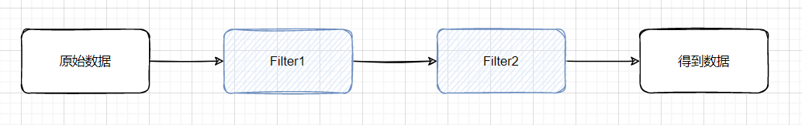
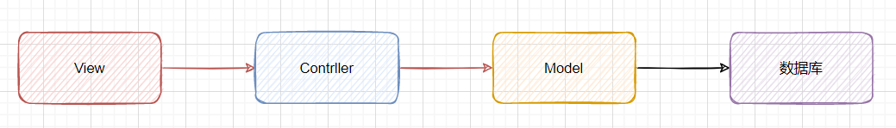

# 结构型模式

## 1.适配器模式（adapter）

假如一个客户需要一个电视，但是现在的店里的国行电视都卖完了，但是店里还有卖剩下的欧版电视，所以需要一个电源适配器，将欧标的电源改为中国大陆所使用的电源。

```java
public class Adapter {
    public static void main(String[] args) {
        EuropeTV europeTV = new EuropeTV();
        ChinaAdapter chinaAdapter = new ChinaAdapter(europeTV);
        chinaAdapter.V220();
    }
}
interface China{
    void V220();
}
interface Europe{
    void V110();
}
class EuropeTV implements Europe{
    @Override
    public void V110() {
        System.out.println("这是一个110的接口");
    }
}
//这是一个诱骗的装配器
class ChinaAdapter implements China{
    Europe europe;

    public ChinaAdapter(Europe europe){
        this.europe = europe;
    }

    @Override
    public void V220() {
        europe.V110();
    }
}
```

## 2.桥连模式

```java
public class Bridge {
    public static void main(String[] args) {
        MacMini macMini = new MacMini();
        MateBook mateBook = new MateBook();
        new MacOS(macMini,"mac","14/").start();
        new WIN(mateBook,"win ","15.6/").start();
    }
}
//新建一个标准电脑
interface Computer{
    void display(String type,String size);
}
class MacMini implements Computer{
    @Override
    public void display(String type, String size) {
        System.out.println("这是一个大小为："+size+"的"+type+"/MacMini电脑");
    }
}
class MateBook implements Computer{
    @Override
    public void display(String type, String size) {
        System.out.println("这是一个大小为："+size+"的"+type+"/MateBook电脑");
    }
}

//设置一个系统进行安装
abstract class OS{
    Computer computer;
    public OS(Computer computer){
        this.computer = computer;
    }
    public abstract void start();
}

class WIN extends OS{
    private String type;
    private String size;
    public WIN(Computer computer,String type,String size) {
        super(computer);
        this.type = type;
        this.size = size;
    }

    @Override
    public void start() {
        System.out.println("欢迎来到Windows");
        computer.display(type,size);
    }
}
class MacOS extends OS{
    private String type;
    private String size;
    public MacOS(Computer computer,String type,String size) {
        super(computer);
        this.type = type;
        this.size = size;
    }

    @Override
    public void start() {
        System.out.println("欢迎来到MacOs");
        computer.display(type,size);
    }
}
```

## 3.过滤器模式（filter）

在java中经常使用的就是过滤器模式，在流处理的过程中也会存在过滤器模式



比如有一群人进入了一个医院做核酸检测，但是医院需要对人进行分流操作，按照年龄来进行划分，得到老年人，青年人和孩童。每个年龄段进入不同的检测点。而现在要做的就是如何对多个list进行分流操作。

这就要用到今天的主角FIlter了，在Stream流批处理中所使用的Filter及其类似。

```java
public class DesignFilter {
    public static void main(String[] args) {
        ArrayList<Person> list = new ArrayList<>();
        list.add(new Person(15, "a"));
        list.add(new Person(1, "b"));
        list.add(new Person(44, "c"));
        list.add(new Person(65, "d"));
        list.add(new Person(75, "e"));
        list.add(new Person(13, "f"));
        list.add(new Person(22, "g"));
        list.add(new Person(44, "h"));
        list.add(new Person(2, "i"));
        list.add(new Person(43, "j"));
        for (Person person : new OldFilter().PeopleFilter(list)) {
            System.out.println(person);
        }
        System.out.println("-------------------------------------");
        for (Person person : new ChildFilter().PeopleFilter(list)) {
            System.out.println(person);
        }
        System.out.println("-------------------------------------");
        for (Person person : new YoungFilter().PeopleFilter(list)) {
            System.out.println(person);
        }
    }
}
class Person{
    private int age;
    private String name;


    public Person(int age, String name) {
        this.age = age;
        this.name = name;
    }

    public int getAge() {
        return age;
    }

    public void setAge(int age) {
        this.age = age;
    }

    @Override
    public String toString() {
        return "Person{" +
                "age=" + age +
                ", name='" + name + '\'' +
                '}';
    }
}
interface Filter{
    List<Person> PeopleFilter(List<Person> people);
}
class OldFilter implements Filter{
    @Override
    public List<Person> PeopleFilter(List<Person> people) {
        ArrayList<Person> oldList = new ArrayList<>();
        for (Person person : people) {
            if(person.getAge()>55) oldList.add(person);
        }
        return oldList;
    }
}

class ChildFilter implements Filter{
    @Override
    public List<Person> PeopleFilter(List<Person> people) {
        ArrayList<Person> childList = new ArrayList<>();
        for (Person person : people) {
            if(person.getAge()<15) childList.add(person);
        }
        return childList;
    }
}

class YoungFilter implements Filter{
    @Override
    public List<Person> PeopleFilter(List<Person> people) {
        ArrayList<Person> youngList = new ArrayList<>();
        for (Person person : people) {
            if(person.getAge()<=55&&person.getAge()>=15) youngList.add(person);
        }
        return youngList;
    }
}
```

## 4.组合模式

组合模式称为部分整体模式，把一组相似的对象当作一个单一的对象。组合模式一句树形结构来组合对象，用来表示部分以及整体层次。这种类型的设计模式属于结构型模式，创建了对象组的树形结构。

创建了一个关于对象组的类，提供了修改相同对象组的方式。

- 使用于上下级关系的UM
- 主要用于树形结构的操作

------

**透明模式**

```java
public class ComponentDesign {
    public static void main(String[] args) {
        Component root = new Composite("root");
        root.add(new Leaf("Leaf A"));
        root.add(new Leaf("Leaf B"));


        Composite composite_x = new Composite("Composite X");
        composite_x.add(new Leaf("Leaf XA"));
        composite_x.add(new Leaf("Leaf XB"));
        root.add(composite_x);

        Composite composite_y = new Composite("Composite XY");
        composite_y.add(new Leaf("Leaf XYA"));
        composite_y.add(new Leaf("Leaf XYB"));
        composite_x.add(composite_y);

        root.display(0);
    }
}
//这是一个抽象共享类，树枝节点和树叶节点都会通过这个类来进行创建
abstract class Component{
    String name;

    public Component(String name) {
        this.name = name;
    }

    public abstract void add(Component component);

    public abstract void remove(Component component);

    public abstract void display(int depth);
}
//这是一个树枝类，可以获取其下面的叶子节点
class Composite extends Component{
    public Composite(String name) {
        super(name);
    }

    private ArrayList<Component> components = new ArrayList<>();

    @Override
    public void add(Component component) {
        this.components.add(component);
    }

    @Override
    public void remove(Component component) {
        this.components.remove(component);
    }

    @Override
    public void display(int depth) {
        for (int i = 0; i < depth; i++) {
            System.out.print('-');
        }
        System.out.println(name);
        for (Component component : components) {
            component.display(depth+1);
        }
    }
}
//这是一个叶子节点，作为一个根节点是无法再添加别的节点的。并且可以通过
class Leaf extends Component{
    public Leaf(String name) {
        super(name);
    }

    @Override
    public void add(Component component) {
        throw new UnsupportedOperationException();
    }

    @Override
    public void remove(Component component) {
        throw new UnsupportedOperationException();
    }

    @Override
    public void display(int depth) {
        for (int i = 0; i < depth; i++) {
            System.out.print('-');
        }
        System.out.println(name);
    }
}
```

## 5.装饰者模式

通过装饰，可以对一个现有的对象添加新的功能，同时不改变其结构。创建一个装饰类，用来包装原有的类，并在保持类方法签名完整性的前提下提供额外的功能。

> 相比直接进行集成，使用装饰者模式可以更加的灵活
>
> 装饰类和被修饰类可以独立发展，不会相互耦合，装饰者模式是继承的一个替代模式，装饰模式可以动态拓展一个实现类的功能。

将首先写一个图形类，通过实现这个图形类得到一个长方形和一个圆形。然后需要对这个图形类进行加工。

简化就是将一个类的实例装进一个新的实现类中，通过对实现类的方法修改来添加一系列的功能。

```java
public class DecoratorDesign {
    public static void main(String[] args) {
        Circle circle = new Circle();
        RedShapeDecorator redShapeCircle = new RedShapeDecorator(new Circle());
        RedShapeDecorator redShapeRectangle = new RedShapeDecorator(new Rectangle());
        circle.draw();

        redShapeCircle.draw();

        redShapeRectangle.draw();
    }
}
interface Shape{
    void draw();
}

class Rectangle implements Shape{
    @Override
    public void draw() {
        System.out.println("Rectangle");
    }
}
class Circle implements Shape{
    @Override
    public void draw() {
        System.out.println("Circle");
    }
}

// 使用一个装饰的抽象类
abstract class ShapeDecorator implements Shape{
    protected Shape shape;

    public ShapeDecorator(Shape shape){
        this.shape = shape;
    }

    @Override
    public void draw() {
        shape.draw();
    }
}
//对装饰类进行实现
class RedShapeDecorator extends ShapeDecorator{
    public RedShapeDecorator(Shape shape) {
        super(shape);
    }

    @Override
    public void draw() {
        shape.draw();
        setRedBorder(shape);
    }
    //新的装饰类
    private void setRedBorder(Shape shape){
        System.out.println(shape);
        System.out.println("Border Color: Red");
    }
}
```

## 6.外观模式

外观模式隐藏系统的复杂性，只是向客户端提供了一系列的接口，客户端通过调用接口来实现服务端的功能。

最基础的应用就是Java WEB中的三层MVC架构，通过对MVC架构的使用来



现在的View层主要是由前端来进行实现，前端的View来调用Java中已经封装好的接口来得到数据库中的值。

在这里就不进行过多的展示了

## 7.亨元模式（Flyweight）

亨元模式用于减少创建对象的数量，减少内存占用和提高性能，减少对象数量以达到所需的对象结构模式。亨元模式会复用现在的同类对象，如果没有再创建新对象。

**实例：**

Java中的String常量池，如果之前创建了一个String，就将这个值存在常量池中，之后如果新建一个已经存在的字符串，则将这个字符串返回给新建的对象，则这两个对象是相同的。

所以亨元模式使用的场景便是：**缓冲池**

所使用的数据结构是HashMap，通过对数据进行读取比较，如果没有则加入到HashMap中，如有则直接返回HashMap的值即可。

## 8.:star:代理模式（Proxy）

在这里存在两种代理模式：**静态代理**和**动态代理**

静态代理是自己来进行实现的代理

动态代理是通过反射包中实现的代理

> 注意：1.和适配器的区别：适配器会改变接口，代理不会改变接口，只是将接口的实现变得简单。
>
> ​			2.和装饰器的区别：装饰器只是加强功能，而代理会对类进行控制。

### **静态代理：**

在代理模式中，可以使用工厂方法隐藏

```java
public class StaticProxy {
    public static void main(String[] args) {
        ConcreteSubject concreteSubject = new ConcreteSubject();
        concreteSubject.request();
        System.out.println("--------------------------------");
        ProxySubject proxySubject = new ProxySubject(new ConcreteSubject());
        proxySubject.request();
    }
}

interface Subject {
    public void request();
}
class ConcreteSubject implements Subject {
    @Override
    public void request() {
        System.out.println("执行代理方法");
    }
}

class ProxySubject implements Subject{
    //要代理的类型
    private Subject subject = null;

    public ProxySubject(Subject subject){
        this.subject = subject;
    }

    @Override
    public void request() {
        this.before();
        this.subject.request();
        this.after();
    }
    private void before(){
        System.out.println("执行before方法");
    }
    private void after(){
        System.out.println("执行after方法");
    }
}
```

但是静态代理还存在着缺点：

代理类和委托类实现了相同的方法，这样就会有大量的代码重复。如果对接口增加一个方法，那么所有的实现类都需要重写这个方法，包括代理类。

代理对象只能服务于一个对象。如果要进行代理，那么需要对每一个对象都进行代理，如果程序规模太大，则会出现任务量翻倍的情况。

基于以上的缺点，Jdk为我们提供了另一种解释方法：**动态代理**

### **动态代理：**

主要使用的接口：

`java.lang.reflect.InvocationHandler` 和 `java.lang.reflect.Proxy`

