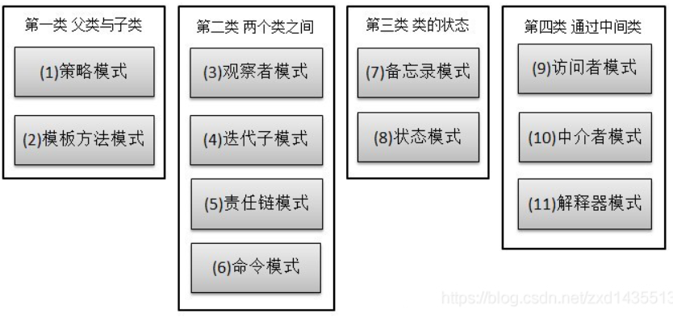
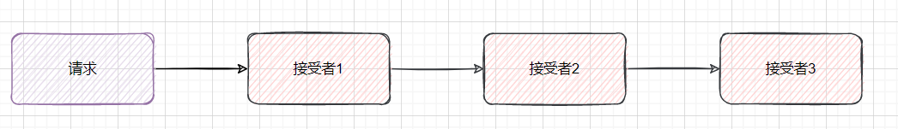
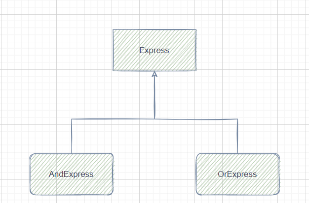
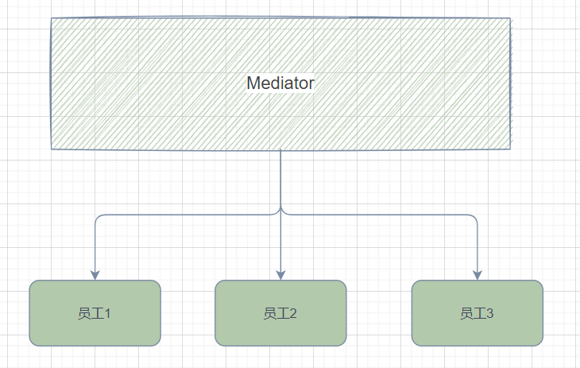

# 行为型模式

**行为型模式**：[模版方法模式](https://github.com/youlookwhat/DesignPattern#9-模板方法模式)、[命令模式](https://github.com/youlookwhat/DesignPattern#6-命令模式)、[迭代器模式](https://github.com/youlookwhat/DesignPattern#17-迭代器模式)、[观察者模式](https://github.com/youlookwhat/DesignPattern#1-观察者模式)、[中介者模式](https://github.com/youlookwhat/DesignPattern#18-中介者模式)、[备忘录模式](https://github.com/youlookwhat/DesignPattern#19-备忘录模式)、[解释器模式](https://github.com/youlookwhat/DesignPattern#20-解释器模式)、[状态模式](https://github.com/youlookwhat/DesignPattern#10-状态模式)、[策略模式](https://github.com/youlookwhat/DesignPattern#4-策略模式)、[责任链模式](https://github.com/youlookwhat/DesignPattern#21-责任链模式)、[访问者模式](https://github.com/youlookwhat/DesignPattern#22-访问者模式)。



## 1.责任链模式

责任链中存在多个类来处理请求，避免一个发送者只对应一个接收者，将这样的对象连城一条链，沿着这个链来进行传递，直到有一个对象处理。

- 链中的每个对象都有机会处理请求
- 链中的每个对象都有下一个处理对象的引用
- 链中的对象如果无法处理请求，则将请求传递给下一个对象




这就是servlet中对过滤器的实现方式，如果不满足条件可以直接跳过执行下一个过滤器，如果满足条件则在这个过程中进行过滤，比如对字符集的检查，如果字符集不满足条件，则抛出异常或者直接拦截向前端返回一个Error错误。在登陆验证和对字符集的过滤中经常看见。

```java
public class ServeltHandler {
    public static void main(String[] args) {
        PreparationList preparationList = new PreparationList();
        preparationList.setWashFace(true);
        preparationList.setWashHair(true);
        preparationList.setHaveBreakfast(false);

        Study study = new Study();

        PrepareFilter washFace = new WashFace();
        PrepareFilter washHair = new WashHair();
        PrepareFilter haveBreakfast = new HaveBreakfast();

        FilterChain filterChain = new FilterChain(study);
        filterChain.addFilter(washFace);
        filterChain.addFilter(washHair);
        filterChain.addFilter(haveBreakfast);

        filterChain.doFilter(preparationList,filterChain);
    }
}

interface PrepareFilter{
    public void doFilter(PreparationList preparationList,FilterChain filterChain);
}
class FilterChain implements PrepareFilter{
    private int pos = 0;

    private Study study;

    private List<PrepareFilter> prepareFilterList;

    public FilterChain(Study study){
        this.study = study;
    }

    public void addFilter(PrepareFilter prepareFilter){
        if(prepareFilterList == null){
            prepareFilterList = new ArrayList<PrepareFilter>();
        }

        prepareFilterList.add(prepareFilter);
    }

    @Override
    public void doFilter(PreparationList preparationList, FilterChain filterChain) {
        if(pos == prepareFilterList.size()) study.study();
        if(pos<prepareFilterList.size())
        prepareFilterList.get(pos++).doFilter(preparationList,filterChain);
    }
}
class WashHair implements PrepareFilter{
    @Override
    public void doFilter(PreparationList preparationList, FilterChain filterChain) {
        if(preparationList.isWashHair()) System.out.println("洗了头发");

        filterChain.doFilter(preparationList,filterChain);
    }
}

class WashFace implements PrepareFilter{
    @Override
    public void doFilter(PreparationList preparationList, FilterChain filterChain) {
        if(preparationList.isWashFace()) System.out.println("洗了脸");

        filterChain.doFilter(preparationList,filterChain);
    }
}

class HaveBreakfast implements PrepareFilter{
    @Override
    public void doFilter(PreparationList preparationList, FilterChain filterChain) {
        if(preparationList.isHaveBreakfast()) System.out.println("吃了早餐");

        filterChain.doFilter(preparationList,filterChain);
    }
}
```

## 2.命令模式

命令模式的优点：

- 类间解耦：调用者角色和接收者角色之间没有任何的依赖关系。调用者实现功能只需要调用Command抽象的execute方法就行，不需要了解是哪个接收者进行执行。
- 可拓展性：Command的子类可以非常容易的进行拓展，而调用者和客户端之间不会出现耦合
- 结合使用：命令模式和其他模式叠加起来进行使用会更加高效。

缺点： 如果使用的Command过多时，会出现类膨胀问题。

```java
public class CommandDesign {
    public static void main(String[] args) {
        Receiver receiver = new Receiver();
        Command concreteCommand = new ConcreteCommand(receiver);
        Invoker invoker = new Invoker();

        invoker.setCommand(concreteCommand);
        invoker.executeCommand();
    }
}
class Receiver{
    public void action(){
        System.out.println("执行请求操作");
    }
}
abstract class Command{
    protected Receiver receiver;

    public Command(Receiver receiver) {
        this.receiver = receiver;
    }
    abstract public void execute();
}
class ConcreteCommand extends Command{
    public ConcreteCommand(Receiver receiver) {
        super(receiver);
    }

    @Override
    public void execute() {
        receiver.action();
    }
}
class Invoker{
    private Command command;
    public void setCommand(Command command){
        this.command = command;
    }
    public void executeCommand(){
        command.execute();
    }
}
```

## 3.解释模式

解释器模式就是将多个模块集成起来返回一个新的模块

在设计模式之禅中用于实现一个简单表达式的计算，可见在正常的程序中使用的情况较少，所以不用重点的去记忆



## 4.迭代器模式

迭代器可以说是Java中最为常见的模式了，主要应用于组件库的遍历（包括数组和一般数据结构）

可以在不知道集合对象的底层表示的情况下对集合对象进行顺序访问。

```java
public class IteratorDesign {
    public static void main(String[] args) {
        NameContainer nameContainer = new NameContainer();
        Iterator iterator = nameContainer.getIterator();
        while (iterator.hasNext()){
            System.out.println(iterator.next());
        }
    }
}
interface Iterator{
    public boolean hasNext();
    public Object next();
}

interface Container{
    public Iterator getIterator();
}

class NameContainer implements Container{
    public String[] names = {"yili","ali","bobo"};

    @Override
    public Iterator getIterator() {
        return new NameIterator();
    }

    private class NameIterator implements Iterator{
        int index;

        @Override
        public boolean hasNext() {
            if(index < names.length) return true;
            return false;
        }

        @Override
        public Object next() {
            if(this.hasNext()) return names[index++];
            return null;
        }

    }
}
```

## 5.中介者模式

在日常生活中比较常见的例子就是电脑的组成，一个电脑存在着多个配件，比如CPU、显卡、硬盘、内存、网卡。。但是如果他们要是互相连接就会出现紊乱的系统。

这个时候就需要主板来进行调度，通过主板的调度来将系统的各个组件连接在一起。可以使组件更高效的生产，同样的在Java架构中可以减少类和类之间的依赖关系从而减少耦合。

同时在Java WEB中的MVC架构就是存在着中介者模式，其中的C就是一个中介者，Model层和View层通过Controller来互相联系。

总结来说就是一个类也就是这个中介者类拥有其他类的引用，其他的类也都存在对中介者的引用，通过向中介者汇报工作，然后通过中介者来进行调度即可。



```java
public class MediatorDesign {
    public static void main(String[] args) {
        Mediator mediator = null;
        Developer developer = new Developer(mediator);
        Market market = new Market(mediator);
        Financial financial = new Financial(mediator);
        mediator = new ConcreteCommand(developer,financial,market);
        mediator.command();
        
    }
}


interface Mediator{
    void command();
}
class ConcreteCommand implements Mediator{
    private Developer developer;
    private Financial financial;
    private Market market;

    public ConcreteCommand(Developer developer, Financial financial, Market market) {
        this.developer = developer;
        this.financial = financial;
        this.market = market;
    }

    @Override
    public void command() {
        System.out.println("向developer提供生产要求");
        System.out.println("向financial提供资金");
        System.out.println("向market提供销售要求");
    }
}
abstract class Colleague{
    private Mediator mediator;

    public Colleague(Mediator mediator) {
        this.mediator = mediator;
    }

    public abstract void outAction();

    public abstract void selfAction();
}
class Developer extends Colleague{
    public Developer(Mediator mediator) {
        super(mediator);
    }

    @Override
    public void outAction() {
        System.out.println("Developer向中介汇报工作");
    }

    @Override
    public void selfAction() {
        System.out.println("Developer正在做工作");
    }
}

class Financial extends Colleague{
    public Financial(Mediator mediator) {
        super(mediator);
    }

    @Override
    public void outAction() {
        System.out.println("Financial向中介汇报工作");
    }

    @Override
    public void selfAction() {
        System.out.println("Financial正在做工作");
    }
}

class Market extends Colleague{
    public Market(Mediator mediator) {
        super(mediator);
    }

    @Override
    public void outAction() {
        System.out.println("Market 向中介汇报工作");
    }

    @Override
    public void selfAction() {
        System.out.println("Market 正在做工作");
    }
}
```

## 6.备忘录模式

备忘录模式保存一个对象的存在状态，以便于在合适的时候恢复对象的状态。

**实例：**

1. 浏览器的回退
2. 系统中的回退
3. 游戏的存档
4. 数据库的事务操作

## 7.观察者模式

对象之间存在着一对多的关系，使用观察者模式。比如，一个对象被修改时，会自动通知对这个类进行依赖的对象，然后进行自动修改。

Java语言中存在着自定义的观察者实现，可以通过实现接口的方式来构建出一个观察者模式。

```java
public class ObserverDesign {
    public static void main(String[] args) {
        Subject subject = new Subject();

        ObserverImpl observer1 = new ObserverImpl();
        ObserverImpl observer2 = new ObserverImpl();
        ObserverImpl observer3 = new ObserverImpl();

        subject.addObserver(observer1);
        subject.addObserver(observer2);
        subject.addObserver(observer3);

        subject.set(3000);
        System.out.println(observer1.getMyState());
        System.out.println(observer2.getMyState());
        System.out.println(observer3.getMyState());

        //对观察者进行删除操作，会发现后续的State没有被修改
        subject.deleteObserver(observer2);

        subject.set(200);
        System.out.println(observer1.getMyState());
        System.out.println(observer2.getMyState());
        System.out.println(observer3.getMyState());
    }
}
class Subject extends Observable {
    private int state;

    public void set(int state){
        this.state = state;
        setChanged();
        notifyObservers(state);
    }

    public int getState() {
        return state;
    }

    public void setState(int state) {
        this.state = state;
    }
}
class ObserverImpl implements Observer{
    private int myState;
    @Override
    public void update(Observable o, Object arg) {
        myState = ((Subject)o).getState();
    }

    public int getMyState() {
        return myState;
    }

    public void setMyState(int myState) {
        this.myState = myState;
    }
}
```

## 8.状态模式

就是在系统中设置多个状态，如果状态发生改变，对象会根据状态的改变表现出不同的行为

**实例**：在互联网公司工作时，会存在多种模式，比如淘宝在双十一的时候会存在者战时模式，在过年快递不发货的时候时待机模式。通过改变不同的状态来改变现在服务器的运营模式。

```java
package com.yili.action.state;

public class StateDesign {
    public static void main(String[] args) {
        Context context = new Context();

        StartState startState = new StartState();
        startState.doAction(context);
        System.out.println(context.getState());

        StopState stopState = new StopState();
        stopState.doAction(context);
        System.out.println(context.getState());

    }
}
class Context {
    private State state;

    public Context(){
        state = null;
    }

    public void setState(State state){
        this.state = state;
    }

    public State getState(){
        return state;
    }
}
interface State{
    public void doAction(Context context);
}
class StopState implements State{
    @Override
    public void doAction(Context context) {
        System.out.println("这是一个Stop状态");
        context.setState(this);
    }

    @Override
    public String toString() {
        return "StopState{}";
    }
}
class StartState implements State{
    @Override
    public void doAction(Context context) {
        System.out.println("这是一个Start状态");
        context.setState(this);
    }

    @Override
    public String toString() {
        return "StartState{}";
    }
}
```

## 9.空对象模式

在空对象中，一个对象取代NULL对象实例的检查。NULL对象不是检查控制，而是一个反应不做任何动作的关系。这样的NULL对象在数据不可用的时候提供默认的行为。

在空对象模式中，我们创建一个抽象类一个实现类以及一个空对象类，这个空对象将无缝地使用在需要检查空值的地方。

## 10.策略模式

策略模式和状态模式的区别

- 状态模式允许对象在内部状态改变时改变它的行为，但是这种行为是有意的，是可以被看见的。

- 策略模式定义了算法族，分别封装起来，让他们之间可以互相替换，可以使客户选择对应的算法实现。
